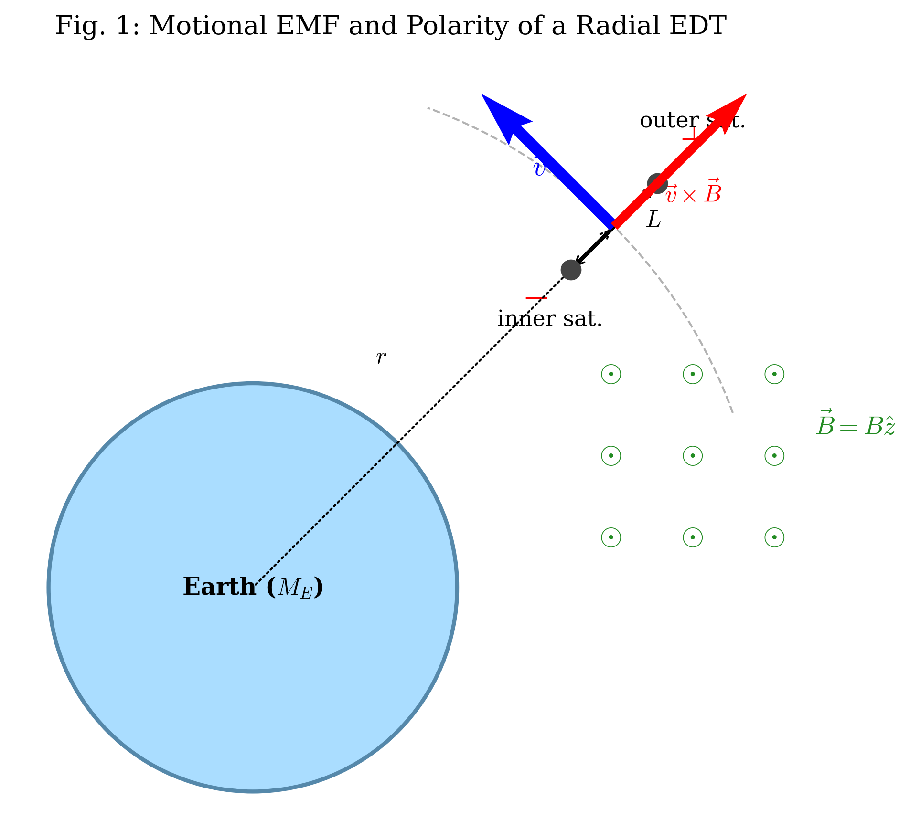
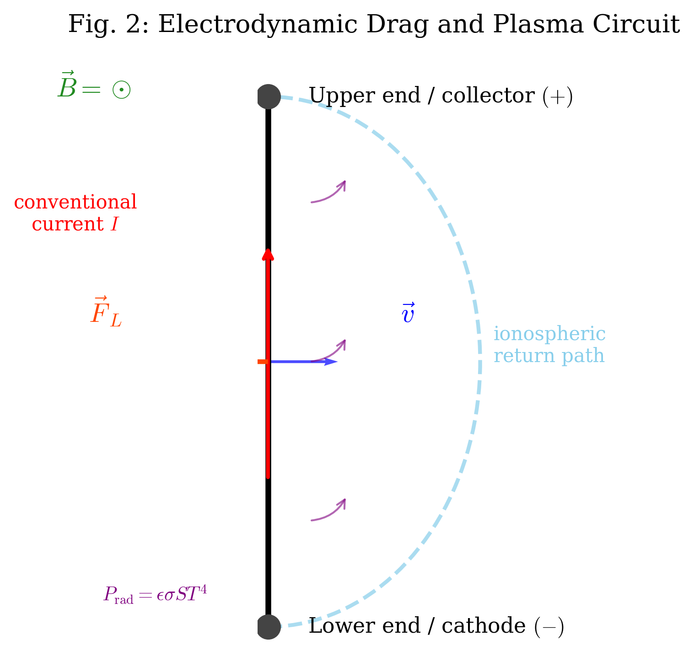

# Orbital Decay and Electro-Thermal Equilibrium of an Electrodynamic Tether

# Question

### Introduction

Electrodynamic tethers (EDTs) are long conducting wires used to exchange energy and momentum with a planetary magnetic field. In this problem, an EDT system consists of two identical small satellites, each of mass $m$, connected by a thin, straight, conductive tether of length $L$ and total resistance $R$. The tether mass is negligible. The system orbits Earth in the equatorial plane at radius $r$, with $r\gg L$. Due to the gravity-gradient effect, the tether is stabilized in a radial orientation, pointing along the local radial direction.

Use Earth-centered cylindrical unit vectors $(\hat r,\hat\phi,\hat z)$ satisfying
$$\hat r\times\hat\phi=\hat z.$$
Here $\hat r$ points radially outward, $\hat\phi$ is the direction of the prograde orbital motion, and $\hat z$ is perpendicular to the orbital plane. In this problem,
$$\vec v=v\hat\phi,\qquad \vec B=B(r)\hat z.$$

**Useful Information:**
* Earth's magnetic field may be modeled locally as a dipole field. In the equatorial plane, its magnitude is
  $$B(r)=B_0\left(\frac{R_E}{r}\right)^3,$$
  where $R_E$ is Earth's radius and $B_0$ is the magnetic field strength at the surface on the equator.
* The mechanical energy of a circular orbit of radius $r$ for total orbiting mass $M_{\rm tot}$ is
  $$E=-\frac{G M_E M_{\rm tot}}{2r}.$$
* For $|x|\ll 1$, the approximation $(1+x)^n\simeq 1+nx$ may be used.
* The effective electron-emission area of the cathode is $S_{\rm emit}=\eta S$, where $S$ is the total radiating surface area used in this problem and $\eta$ is a dimensionless factor.



---

### Part A: Orbital Dynamics and Motional EMF (3.0 points)

The center of mass of the two-satellite system moves at the Keplerian speed $v=\sqrt{G M_E/r}$.

**A.1.** Using a rotating reference frame centered on the system's center of mass, find the tension $T_N$ at the midpoint of the tether. Use a first-order Taylor expansion in $L/r$. Express your result in terms of $G$, $M_E$, $m$, $L$, and $r$. **[1.2 pt]**

**A.2.** As the conductive tether cuts through Earth's magnetic field lines, a motional electromotive force is generated between its two ends. Find the magnitude of the EMF, $\mathcal E(r)$, to leading order in $L/r$. **[1.0 pt]**

**A.3.** Using the coordinate convention above, determine the polarity of the induced EMF. Which satellite, the one closer to Earth or the one farther from Earth, accumulates positive charge? **[0.8 pt]**

---

### Part B: Electrodynamic Drag and Orbital Evolution (4.0 points)

The tether is immersed in the ionospheric plasma, which acts as a return path with negligible resistance. Specialized contactors close the circuit through the plasma. The lower end acts as a hollow cathode, while the upper end acts as an electron-collecting end. Thus the conventional current in the metallic tether flows radially outward, from the lower satellite to the upper satellite. A steady current $I$ flows through the tether.



**B.1.** Derive the total Lorentz force $\vec F_L$ acting on the tether to leading order in $L/r$. Show that this force acts opposite to the orbital velocity $\vec v$. **[1.0 pt]**

**B.2.** Due to the work done by the Lorentz force, the system's mechanical energy decreases, causing the orbit to decay. Assuming the orbit remains quasi-circular at all times, derive the differential equation for $dr/dt$ in terms of $I$, $B_0$, $L$, $m$, $M_E$, $R_E$, and $r$. **[1.5 pt]**

**B.3.** Let $Q$ be the total charge transferred through the tether as the system descends from an initial radius $r_1$ to a final radius $r_2$, where $r_1>r_2$. Prove that
$$Q=\int I\,dt$$
is independent of the tether resistance $R$ and independent of the detailed time evolution of the current. Find $Q$ in terms of $r_1$, $r_2$, $m$, $L$, and the planetary constants. **[1.5 pt]**

---

### Part C: Electro-Thermal Limits and Asymptotic Evolution (3.0 points)

In a realistic system, the current is limited by both the available motional EMF and the ability of the cathode to emit electrons into the plasma. The current cannot exceed the thermionic saturation current of the cathode.

**Useful Information for Part C:**
* Stefan-Boltzmann law:
  $$P_{\rm rad}=\epsilon\sigma S T^4,$$
  where $\epsilon$ is the emissivity, $\sigma$ is the Stefan-Boltzmann constant, $S$ is the radiating area, and $T$ is the system temperature.
* Richardson's law for thermionic emission:
  $$I_{\rm sat}=\eta S A_R T^2\exp\left(-\frac{\Phi}{k_B T}\right),$$
  where $A_R$ is Richardson's constant and $\Phi$ is the work function. Here $\Phi$ is treated as an energy, so $\Phi/(k_BT)$ is dimensionless.
* Each emitted electron removes approximately the work-function energy $\Phi$, so the emission-cooling power is
  $$P_{\rm emit}=\frac{I\Phi}{e}.$$

**C.1.** The tether reaches a steady-state temperature $T_{\rm eq}$ when Joule heating is balanced by thermal radiation and emission cooling. Write the coupled equations and inequality that determine whether the system is in the emission-limited steady state. Your answer should include the Ohmic current allowed by the motional EMF and the thermionic saturation current. **[1.2 pt]**

**C.2.** Consider the high-temperature emission-limited asymptotic regime
$$I^2R\gg \frac{I\Phi}{e},\qquad k_BT\gg\Phi.$$
Use
$$\exp\left(-\frac{\Phi}{k_BT}\right)\simeq 1-\frac{\Phi}{k_BT}.$$
Assume the system remains emission-limited, so that $I=I_{\rm sat}$, and assume the motional EMF is sufficiently large to support this current:
$$IR\le \mathcal E(r).$$
Find the leading nontrivial asymptotic expression for the orbital decay rate $|dr/dt|$, expressed in terms of the material and geometric constants $S,\epsilon,\sigma,R,\eta,A_R,\Phi,k_B,L$, the satellite mass $m$, and the local orbital quantities $B$, $v$, and $r$. State the conditions for this asymptotic solution to exist. **[1.8 pt]**

# QuestionReview

### Physics Review Notes

The problem is suitable for use after revision. Parts A and B form a coherent mechanics and electrodynamics chain: gravity-gradient tension, motional EMF, Lorentz drag, orbital energy loss, and the charge-transfer integral. Part C is consistent with the earlier sections because it distinguishes the available Ohmic current from the cathode emission limit.

The electro-thermal model separates two regimes:

1. **EMF-limited / Ohmic regime:** $I=\mathcal E/R$.
2. **Emission-limited regime:** $I=I_{\rm sat}(T)$ with the consistency condition $I_{\rm sat}R\le\mathcal E$.

Part C.2 uses the emission-limited regime. The current is obtained from Joule-radiation balance together with the high-temperature Richardson expansion, while the motional EMF appears as the condition that the orbit can support the required current.

### Revision Notes

* A fixed coordinate convention was added so the polarity in A.3 and the drag direction in B.1 are unambiguous.
* The conventional current direction in Part B was explicitly specified.
* B.3 was reworded because $Q$ depends on $m$ and $L$ as well as planetary constants; the correct independence statement is independence from $R$ and from the detailed current history.
* C.1 now states the actual current as $I=\min(\mathcal E/R,I_{\rm sat})$.
* C.2 now treats the high-temperature **emission-limited** regime rather than the EMF-limited regime.
* The diagram requirements were updated to show polarity and conventional current direction.

# Answer

### Part A: Orbital Dynamics and Motional EMF

**[A.1's Standard Solution]**

In the rotating frame centered at the system's center of mass, the angular velocity is
$$\omega=\sqrt{\frac{G M_E}{r^3}}.$$
Let $x$ be the radial displacement from the center of mass, positive outward. The effective radial force on a satellite fixed in this rotating frame is
$$F_{\rm eff}=m\omega^2(r+x)-\frac{G M_E m}{(r+x)^2}.$$
For $|x|\ll r$,
$$m\omega^2(r+x)=\frac{G M_E m}{r^2}\left(1+\frac{x}{r}\right),$$
and
$$\frac{G M_E m}{(r+x)^2}\simeq \frac{G M_E m}{r^2}\left(1-\frac{2x}{r}\right).$$
Thus
$$F_{\rm eff}\simeq
\frac{G M_E m}{r^2}
\left[
1+\frac{x}{r}-\left(1-\frac{2x}{r}\right)
\right]
=\frac{3G M_E m x}{r^3}.$$
For the outer satellite, $x=L/2$, so the outward effective force has magnitude
$$\frac{3G M_E mL}{2r^3}.$$
The tether is massless, so it transmits this force as a uniform tension.

**[Final Result]** :
$$T_N=\frac{3G M_E mL}{2r^3}.$$

**[A.2's Standard Solution]**

The motional EMF is
$$\mathcal E=\int(\vec v\times\vec B)\cdot d\vec l.$$
For a radially oriented tether, $d\vec l=dr'\hat r$. To leading order in $L/r$, one may use the center-of-mass values:
$$\mathcal E\simeq vB(r)L.$$
Using
$$v=\sqrt{\frac{G M_E}{r}},\qquad B(r)=B_0\left(\frac{R_E}{r}\right)^3,$$
we obtain
$$\mathcal E(r)=B_0R_E^3L\sqrt{\frac{G M_E}{r^7}}.$$

**[Final Result]** :
$$\mathcal E(r)=B(r)v(r)L
=B_0R_E^3L\sqrt{\frac{G M_E}{r^7}}.$$

**[A.3's Standard Solution]**

With the stated convention,
$$\vec v\times\vec B=vB\,\hat\phi\times\hat z=vB\,\hat r.$$
Thus positive charges are pushed radially outward. The outer satellite is at the higher electric potential.

**[Final Result]** :
The satellite farther from Earth accumulates positive charge.

---

### Part B: Electrodynamic Drag and Orbital Evolution

**[B.1's Standard Solution]**

The Lorentz force on a current element is
$$d\vec F_L=I\,d\vec l\times\vec B.$$
The conventional current flows radially outward, so $d\vec l=dr'\hat r$. Therefore
$$d\vec F_L=I\,dr'\hat r\times B(r')\hat z
=-I B(r')\,dr'\hat\phi.$$
To leading order in $L/r$,
$$\vec F_L\simeq -I B(r)L\hat\phi.$$
Since $\vec v=v\hat\phi$, the force is exactly opposite to the orbital velocity.

**[Final Result]** :
$$\vec F_L\simeq -I B(r)L\hat v.$$

**[B.2's Standard Solution]**

The total mass of the two satellites is $2m$, so the circular-orbit mechanical energy is
$$E=-\frac{G M_E(2m)}{2r}=-\frac{G M_E m}{r}.$$
The electrodynamic drag power is
$$\frac{dE}{dt}=\vec F_L\cdot\vec v=-I B(r)Lv.$$
Also,
$$\frac{dE}{dt}=\frac{G M_E m}{r^2}\frac{dr}{dt}.$$
Therefore
$$\frac{G M_E m}{r^2}\frac{dr}{dt}
=-I B(r)L\sqrt{\frac{G M_E}{r}}.$$
Solving for $dr/dt$ gives
$$\frac{dr}{dt}
=-\frac{I B(r)Lr^{3/2}}{m\sqrt{G M_E}}.$$
Using $B(r)=B_0R_E^3/r^3$,
$$\frac{dr}{dt}
=-\frac{I B_0R_E^3L}{m\sqrt{G M_E}\,r^{3/2}}.$$

**[Final Result]** :
$$\frac{dr}{dt}
=-\frac{I B_0R_E^3L}{m\sqrt{G M_E}\,r^{3/2}}.$$

**[B.3's Standard Solution]**

From B.2,
$$I\,dt
=-\frac{m\sqrt{G M_E}}{B(r)Lr^{3/2}}\,dr.$$
Therefore, for descent from $r_1$ to $r_2$,
$$Q=\int I\,dt
=\int_{r_1}^{r_2}
-\frac{m\sqrt{G M_E}}{B(r)Lr^{3/2}}\,dr.$$
Since $B(r)=B_0R_E^3/r^3$,
$$Q=
\frac{m\sqrt{G M_E}}{B_0R_E^3L}
\int_{r_2}^{r_1}r^{3/2}\,dr.$$
Thus
$$Q=
\frac{m\sqrt{G M_E}}{B_0R_E^3L}
\cdot\frac{2}{5}\left(r_1^{5/2}-r_2^{5/2}\right).$$

**[Final Result]** :
$$Q=
\frac{2m\sqrt{G M_E}}{5B_0R_E^3L}
\left(r_1^{5/2}-r_2^{5/2}\right).$$
This expression contains neither $R$ nor the detailed function $I(t)$.

---

### Part C: Electro-Thermal Limits and Asymptotic Evolution

**[C.1's Standard Solution]**

The Ohmic current that could be driven by the motional EMF is
$$I_{\rm Ohm}=\frac{\mathcal E}{R}.$$
The thermionic saturation current is
$$I_{\rm sat}(T_{\rm eq})
=\eta S A_R T_{\rm eq}^2
\exp\left(-\frac{\Phi}{k_BT_{\rm eq}}\right).$$
The actual current is limited by the smaller of these two currents:
$$I=\min\left(I_{\rm Ohm},I_{\rm sat}\right).$$
In the emission-limited steady state,
$$I=I_{\rm sat},\qquad I_{\rm sat}R\le \mathcal E.$$
The thermal balance is
$$I^2R=\epsilon\sigma S T_{\rm eq}^4+\frac{I\Phi}{e}.$$

**[Final Result]** :
In the emission-limited steady state, $T_{\rm eq}$ and $I$ are determined by
$$
\boxed{
\begin{cases}
I=\eta S A_R T_{\rm eq}^2
\exp\left(-\dfrac{\Phi}{k_BT_{\rm eq}}\right),\\[5pt]
I^2R=\epsilon\sigma S T_{\rm eq}^4+\dfrac{I\Phi}{e},\\[5pt]
IR\le \mathcal E(r).
\end{cases}}
$$

**[C.2's Standard Solution]**

In the limit
$$I^2R\gg \frac{I\Phi}{e},$$
the heat balance becomes
$$I^2R\simeq \epsilon\sigma S T^4.$$
Taking the positive square root,
$$I\simeq \sqrt{\frac{\epsilon\sigma S}{R}}\,T^2.$$
Define
$$C=\sqrt{\frac{\epsilon\sigma S}{R}}.$$
Then
$$I\simeq CT^2.$$
Using the high-temperature Richardson expansion,
$$I\simeq \eta S A_R T^2\left(1-\frac{\Phi}{k_BT}\right).$$
Define
$$K=\eta S A_R,\qquad a=\frac{\Phi}{k_B}.$$
Then
$$CT^2=KT^2\left(1-\frac{a}{T}\right).$$
Canceling $T^2$ gives
$$C=K\left(1-\frac{a}{T}\right).$$
Thus
$$T=\frac{a}{1-C/K}
=\frac{\Phi/k_B}
{1-\dfrac{1}{\eta S A_R}\sqrt{\dfrac{\epsilon\sigma S}{R}}}.$$
The high-temperature assumption requires
$$0<\delta\equiv 1-\frac{C}{K}\ll 1.$$
The corresponding current is
$$I=CT^2
=\sqrt{\frac{\epsilon\sigma S}{R}}
\left[
\frac{\Phi/k_B}
{1-\dfrac{1}{\eta S A_R}\sqrt{\dfrac{\epsilon\sigma S}{R}}}
\right]^2.$$
From Part B,
$$\left|\frac{dr}{dt}\right|=\frac{I B L r}{m v}.$$
Substituting the asymptotic current yields the desired rate.

**[Final Result]** :
$$
\left|\frac{dr}{dt}\right|
=
\frac{B L r}{m v}
\sqrt{\frac{\epsilon\sigma S}{R}}
\left[
\frac{\Phi/k_B}
{1-\dfrac{1}{\eta S A_R}\sqrt{\dfrac{\epsilon\sigma S}{R}}}
\right]^2.
$$
This expression is valid provided
$$0<1-\frac{1}{\eta S A_R}\sqrt{\frac{\epsilon\sigma S}{R}}\ll 1,$$
$$IR\le \mathcal E(r)=BvL,$$
and
$$I^2R\gg \frac{I\Phi}{e},\qquad k_BT\gg \Phi.$$

# AnswerValidation

### Physical Consistency Audit

A.1: The coefficient $3/2$ is correct for two point masses joined by a massless tether. A coefficient such as $3/4$ would correspond to a different mass distribution and should not be used here.

A.2: The leading-order EMF $\mathcal E=vBL$ is consistent with the more exact integral over the tether. Field and velocity variation along the tether only affects higher-order terms in $L/r$.

A.3 and B.1: The sign is now unambiguous because the coordinate convention is fixed. Since $\vec v\times\vec B$ points along $+\hat r$, the outer satellite becomes positive. Since conventional current flows outward through the tether, $\vec F_L=IL\hat r\times B\hat z=-IBL\hat\phi$, which is a drag force.

B.2 and B.3: The use of total mass $2m$ gives $E=-GM_Em/r$. The cancellation of $I$ in B.3 is physically meaningful: the total transferred charge depends on the required orbital energy or angular-momentum change per unit charge, not on how quickly the current flows.

C.1 and C.2: The revised Part C distinguishes the Ohmic current $\mathcal E/R$ from the thermionic saturation current $I_{\rm sat}(T)$. The high-temperature result in C.2 is emission-limited, so the current is fixed by the coupled thermal and Richardson equations, while the motional EMF enters as the support condition $IR\le\mathcal E$.

# GradingRubric

### IPHO-Style Marking Scheme

**Total Score: 10.0 pts**

#### Part A: Orbital Dynamics and Motional EMF (Total: 3.0 pts)

| Sub-part | Item / Key Equation | Marks | Notes for Graders |
| :--- | :--- | :--- | :--- |
| **A.1** | Writes the rotating-frame effective radial force $F_{\rm eff}=m\omega^2(r+x)-GM_E m/(r+x)^2$. | 0.3 | Accept equivalent tidal-force methods. |
| | Uses $\omega^2=GM_E/r^3$ and expands to first order in $x/r$. | 0.4 | |
| | Obtains $F_{\rm eff}=3GM_E mx/r^3$. | 0.2 | |
| | Substitutes $x=L/2$ and identifies this as the massless-tether tension. | 0.3 | |
| **A.2** | Uses $\mathcal E=\int(\vec v\times\vec B)\cdot d\vec l$, or equivalently $\mathcal E\simeq vBL$. | 0.3 | |
| | Substitutes $v=\sqrt{GM_E/r}$ and $B=B_0(R_E/r)^3$. | 0.4 | |
| | Obtains $\mathcal E=B_0R_E^3L\sqrt{GM_E/r^7}$. | 0.3 | |
| **A.3** | Correctly uses $\vec v\times\vec B$ and the stated coordinate convention. | 0.4 | |
| | Concludes that the outer satellite becomes positive. | 0.4 | |
| **Subtotal** | Part A Total | **3.0** | |

---

#### Part B: Electrodynamic Drag and Orbital Evolution (Total: 4.0 pts)

| Sub-part | Item / Key Equation | Marks | Notes for Graders |
| :--- | :--- | :--- | :--- |
| **B.1** | Writes $d\vec F_L=I\,d\vec l\times\vec B$. | 0.3 | |
| | Uses outward conventional current, $d\vec l=dr\,\hat r$. | 0.2 | |
| | Computes $\hat r\times\hat z=-\hat\phi$. | 0.2 | |
| | Obtains $\vec F_L\simeq -IBL\hat\phi$ and identifies it as drag. | 0.3 | |
| **B.2** | Uses total orbital energy $E=-GM_E(2m)/(2r)=-GM_E m/r$. | 0.4 | Deduct for forgetting the two satellites. |
| | Writes the power balance $dE/dt=-IBLv$. | 0.4 | Negative sign is essential. |
| | Applies $dE/dt=(GM_E m/r^2)(dr/dt)$. | 0.3 | Angular momentum method is also acceptable. |
| | Substitutes $v=\sqrt{GM_E/r}$ and $B=B_0R_E^3/r^3$, then obtains the final $dr/dt$. | 0.4 | |
| **B.3** | Sets up $Q=\int I\,dt$ and substitutes $dt=dr/(dr/dt)$. | 0.4 | |
| | Shows the current $I$ cancels. | 0.4 | Main conceptual point. |
| | Substitutes $B(r)=B_0R_E^3/r^3$. | 0.3 | |
| | Integrates $\int r^{3/2}dr=(2/5)r^{5/2}$ with correct limits. | 0.3 | |
| | Final expression $Q=\frac{2m\sqrt{GM_E}}{5B_0R_E^3L}(r_1^{5/2}-r_2^{5/2})$. | 0.1 | |
| **Subtotal** | Part B Total | **4.0** | |

---

#### Part C: Electro-Thermal Limits and Asymptotic Evolution (Total: 3.0 pts)

| Sub-part | Item / Key Equation | Marks | Notes for Graders |
| :--- | :--- | :--- | :--- |
| **C.1** | Identifies $I_{\rm Ohm}=\mathcal E/R$. | 0.2 | |
| | Writes $I_{\rm sat}=\eta S A_R T^2\exp[-\Phi/(k_BT)]$. | 0.3 | |
| | States $I=\min(I_{\rm Ohm},I_{\rm sat})$. | 0.2 | |
| | Writes energy balance $I^2R=\epsilon\sigma ST^4+I\Phi/e$. | 0.4 | |
| | Gives emission-limited consistency condition $IR\le\mathcal E$. | 0.1 | |
| **C.2** | Uses $I^2R\simeq \epsilon\sigma ST^4$ and obtains $I=CT^2$, $C=\sqrt{\epsilon\sigma S/R}$. | 0.3 | |
| | Uses Richardson expansion $I\simeq KT^2(1-a/T)$, with $K=\eta SA_R$ and $a=\Phi/k_B$. | 0.3 | |
| | Solves $C=K(1-a/T)$ for $T=a/(1-C/K)$. | 0.4 | |
| | Obtains $I=C[a/(1-C/K)]^2$. | 0.3 | |
| | Substitutes into $|dr/dt|=IBLr/(mv)$. | 0.3 | |
| | States existence and consistency conditions: $0<1-C/K\ll1$, $IR\le\mathcal E$, $I^2R\gg I\Phi/e$, and $k_BT\gg\Phi$. | 0.2 | |
| **Subtotal** | Part C Total | **3.0** | |

---

### Grading Notes and Pitfalls

1. In A.2, either the full integral or the center-of-mass approximation receives full credit because both give the same leading-order term.
2. In A.3 and B.1, the sign must follow the stated coordinate convention.
3. In B.2, the total orbiting mass is $2m$, not $m$.
4. In C.2, a solution with $I=\mathcal E/R$ is the EMF-limited regime, not the requested emission-limited asymptotic regime. It should not receive full credit for C.2 unless the student clearly identifies it as a different regime.

# DiagramCode

### Image Revision Requirements

The two figures should be updated rather than left as generic orbit/circuit drawings.

1. Figure 1 should show the polarity:
   * outer satellite: $+$
   * inner satellite: $-$
   * optional arrow: $\vec v\times\vec B$ radially outward

2. Figure 2 should explicitly state that $I$ is conventional current:
   * current arrow outward/upward along the tether
   * label: "conventional current"
   * Lorentz force $\vec F_L$ opposite to $\vec v$

### Integrated Python Script

```python
import matplotlib.pyplot as plt
import matplotlib.patches as patches
import numpy as np

plt.rcParams.update({
    "text.usetex": False,
    "mathtext.fontset": "cm",
    "font.family": "serif",
    "font.size": 11,
})

def generate_figure_1():
    fig, ax = plt.subplots(figsize=(7, 6))
    ax.set_aspect("equal")
    ax.axis("off")

    earth_radius = 2.0
    earth = patches.Circle((0, 0), earth_radius, color="#AADDFF", ec="#5588AA", lw=2)
    ax.add_patch(earth)
    ax.text(0, 0, r"Earth ($M_E$)", ha="center", va="center", fontsize=12, fontweight="bold")

    orbit_r = 5.0
    orbit_arc = patches.Arc((0, 0), 2 * orbit_r, 2 * orbit_r, theta1=20, theta2=70,
                            ls="--", color="gray", alpha=0.6)
    ax.add_patch(orbit_arc)

    angle = np.deg2rad(45)
    r_inner = orbit_r - 0.6
    r_outer = orbit_r + 0.6
    x_inner, y_inner = r_inner * np.cos(angle), r_inner * np.sin(angle)
    x_outer, y_outer = r_outer * np.cos(angle), r_outer * np.sin(angle)

    ax.plot([x_inner, x_outer], [y_inner, y_outer], color="black", lw=2, zorder=3)
    ax.scatter([x_inner, x_outer], [y_inner, y_outer], color="#444444", s=90, zorder=4)
    ax.text(x_inner - 0.35, y_inner - 0.35, r"$-$", fontsize=18, color="red", ha="center")
    ax.text(x_outer + 0.35, y_outer + 0.35, r"$+$", fontsize=18, color="red", ha="center")
    ax.text(x_inner - 0.2, y_inner - 0.55, "inner sat.", ha="center")
    ax.text(x_outer + 0.35, y_outer + 0.55, "outer sat.", ha="center")

    ax.annotate("", xy=(x_outer, y_outer), xytext=(x_inner, y_inner),
                arrowprops=dict(arrowstyle="<->", color="black"))
    ax.text((x_inner + x_outer) / 2 + 0.3, (y_inner + y_outer) / 2, r"$L$", fontsize=12)

    center = np.array([(x_inner + x_outer) / 2, (y_inner + y_outer) / 2])
    v_dir = np.array([-np.sin(angle), np.cos(angle)])
    r_dir = np.array([np.cos(angle), np.sin(angle)])

    ax.annotate("", xy=(orbit_r * np.cos(angle), orbit_r * np.sin(angle)), xytext=(0, 0),
                arrowprops=dict(arrowstyle="->", color="black", ls=":"))
    ax.text(1.2, 2.2, r"$r$", fontsize=12)

    ax.quiver(center[0], center[1], v_dir[0], v_dir[1],
              color="blue", scale=4, width=0.015, zorder=5)
    ax.text(center[0] - 0.8, center[1] + 0.5, r"$\vec v$", color="blue", fontsize=14)

    ax.quiver(center[0], center[1], r_dir[0], r_dir[1],
              color="red", scale=4, width=0.012, zorder=5)
    ax.text(*(center + 0.52 * r_dir - 0.18 * v_dir), r"$\vec v\times\vec B$", color="red", fontsize=12)

    for i in range(3):
        for j in range(3):
            bx, by = 3.5 + i * 0.8, 0.5 + j * 0.8
            ax.text(bx, by, r"$\odot$", color="forestgreen", fontsize=15,
                    ha="center", va="center")
    ax.text(5.5, 1.5, r"$\vec B=B\hat z$", color="forestgreen", fontsize=13)

    plt.title("Fig. 1: Motional EMF and Polarity of a Radial EDT", pad=20)
    plt.tight_layout()
    plt.savefig("image/ipho_2025_1_1.png", dpi=300, bbox_inches="tight")
    plt.close(fig)

def generate_figure_2():
    fig, ax = plt.subplots(figsize=(7, 5))
    ax.set_aspect("equal")
    ax.axis("off")

    ax.plot([0, 0], [-2, 2], color="black", lw=3, zorder=3)
    ax.scatter([0, 0], [-2, 2], color="#444444", s=150, zorder=4)
    ax.text(0.3, 2, r"Upper end / collector $(+)$", va="center")
    ax.text(0.3, -2, r"Lower end / cathode $(-)$", va="center")

    ax.annotate("", xy=(0, 0.9), xytext=(0, -0.9),
                arrowprops=dict(arrowstyle="->", color="red", lw=2))
    ax.text(-1.45, 1.12, "conventional\ncurrent $I$", color="red",
            fontsize=10, ha="center", va="center")

    ax.quiver(0, 0, 1.5, 0, color="blue", scale=5, width=0.012, alpha=0.7)
    ax.text(1.0, 0.3, r"$\vec v$", color="blue", fontsize=14)

    ax.quiver(0, 0, -1.5, 0, color="orangered", scale=5, width=0.02, zorder=5)
    ax.text(-1.35, 0.3, r"$\vec F_L$", color="orangered", fontsize=14)

    arc_theta = np.linspace(-np.pi / 2, np.pi / 2, 80)
    arc_x = 1.6 * np.cos(arc_theta)
    arc_y = 2.0 * np.sin(arc_theta)
    ax.plot(arc_x, arc_y, color="skyblue", ls="--", lw=2, alpha=0.7)
    ax.text(1.7, 0, "ionospheric\nreturn path", color="skyblue", ha="left", fontsize=10)

    for y_pos in [-1.2, 0, 1.2]:
        for direction in [-1, 1]:
            dx = 0.3 * direction
            ax.annotate("", xy=(dx * 2, y_pos + 0.2), xytext=(dx, y_pos),
                        arrowprops=dict(arrowstyle="->", connectionstyle="arc3,rad=.3",
                                        color="purple", alpha=0.6))
    ax.text(-1.25, -1.8, r"$P_{\rm rad}=\epsilon\sigma ST^4$",
            color="purple", fontsize=10)
    ax.text(-1.6, 2, r"$\vec B=\odot$", color="forestgreen", fontsize=14)

    plt.title("Fig. 2: Electrodynamic Drag and Plasma Circuit", pad=20)
    plt.tight_layout()
    plt.savefig("image/ipho_2025_1_2.png", dpi=300, bbox_inches="tight")
    plt.close(fig)

if __name__ == "__main__":
    generate_figure_1()
    generate_figure_2()
```
